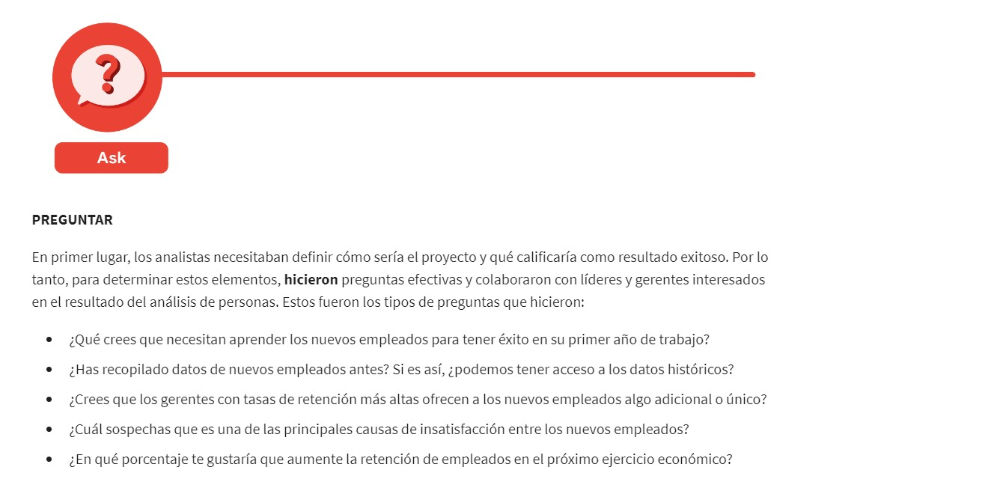
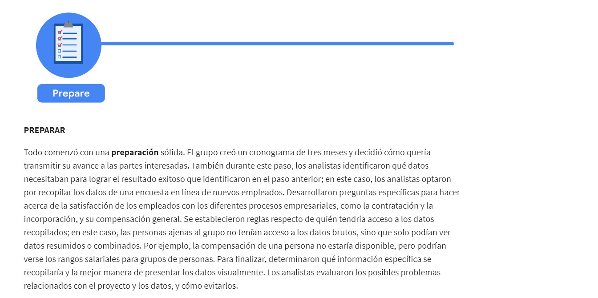
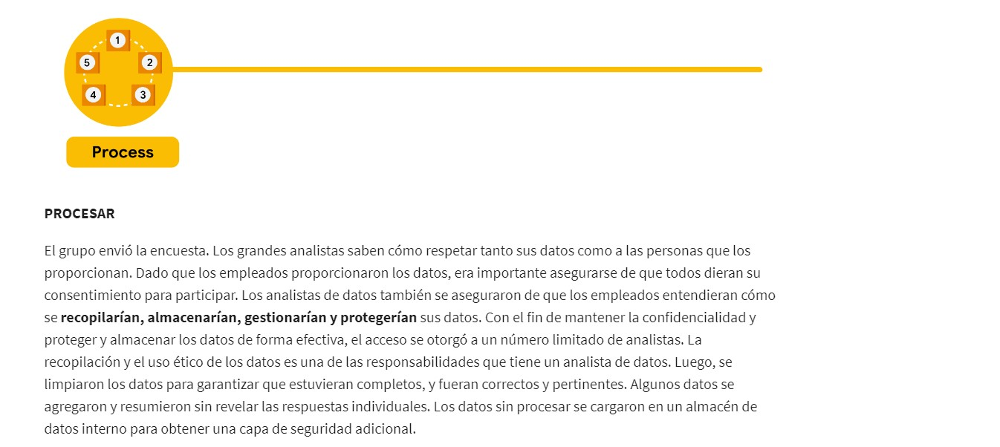
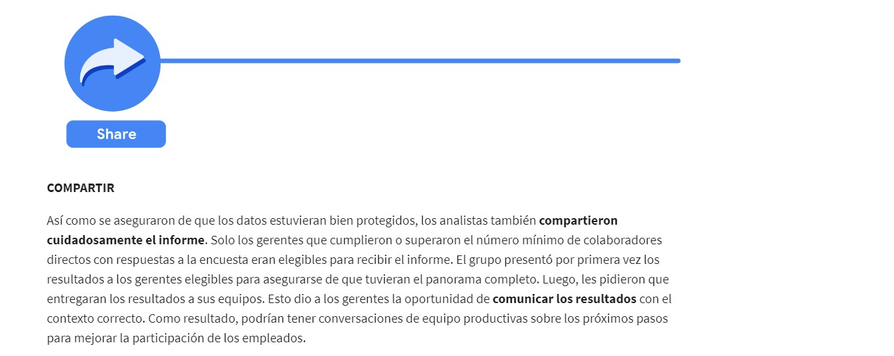
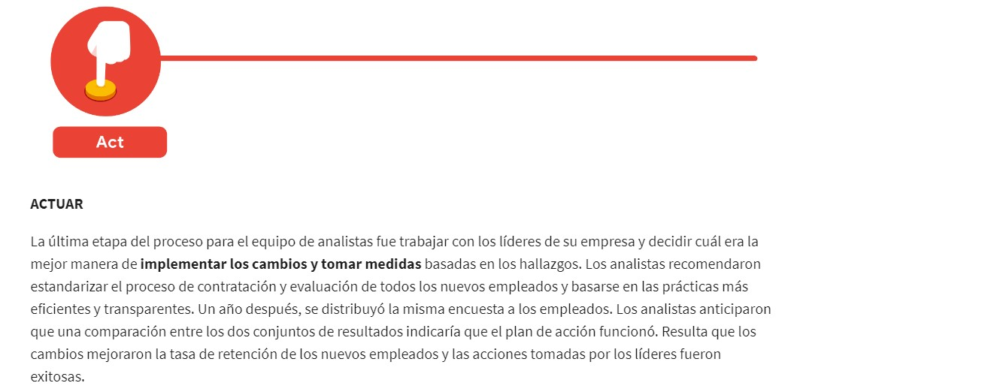

# Curso 1. Presentación del análisis computacional de datos

##### Analista de datos  
Alguien que colecciona, transforma y organiza datos con el fin de ayudar a tomar decisiones fundamentadas
##### Proceso para el análisis de datos  
- Preguntar  
- Preparar  
- Procesar  
- Analizar  
- Compartir
- Actuar  

##### Datos 
Recopilación de hechos o información  

### Transformación de datos en conocimiento  
Las empresas utilizan los datos para:  
- Mejorar procesos.  
- Identificar oportunidades y tendencias.    
- Lanzamientos nuevos.  
- Servicio a clientes.  
- Toma de decisiones bien pensadas.  

El análisis te ayuda a encontrar formas más fáciles de hacer las cosas, identificar patrones para ahorrar tiempo y descubrir nuevas perspectivas sorprendentes que pueden cambiar por completo la forma en que experimentas las cosas.  

La **ciencia de datos** abarca tres disciplinas:
- Machine Learning e IA: Automatización de muchas decisiones con incertidumbre.
- Estadistica: Toma de decisones importantes con incertidumbre.
- Análisis: Se desconocen las decisiones que se desean tomar antes de empezar.

#### Análisis de personas  
Es la práctica de recopilar y analizar datos sobre las personas que conforman la fuerza laboral de una empresa con el fin de obtener información para mejorar su funcionamiento. Ser analista de personas implica utilizar el análisis de datos para obtener información sobre los empleados y cómo viven su vida laboral. El conocimiento se utiliza para definir y crear un lugar de trabajo más productivo y empoderador. Esto puede liberar el potencial de los empleados, motivar a las personas a rendir al máximo y garantizar una cultura empresarial justa e inclusiva.  

**Problematica:** Una organización estaba teniendo una alta tasa de rotación entre los nuevos empleados. Muchos empleados abandonaron la empresa antes del final de su primer año de trabajo. Los analistas utilizaron el proceso de análisis de datos para responder la siguiente pregunta: ¿cómo puede la organización mejorar la tasa de retención de los nuevos empleados?  

### Inteligencia de decisiones  
Es una combinación de la ciencia de datos aplicada y ciencias sociales y gerenciales.

### Ecosistema de datos  
#### Ecosistema  
Grupo de elementos que interactúan uno con el otro. Los ecosistemas pueden ser grandes o diminutos.  
#### Ecosistema de datos  
Se componen de varios elementos que interactúan entre sí para producir, gestionar, almacenar, organizar, analizar y compartir datos. Estos elementos incluyen hardware, software y las personas que los usan.  
#### Cloud  
Lugar para mantener los datos en línea, en lugar de en el disco duro de una computadora. Los datos se acceden a través de internet. Desempeña un papel importante en el ecosistema de datos.  
#### Ciencia de datos  
Crear nuevas formas de modelar y entender lo desconocido mediante el uso de datos sin procesar.  
#### Analista de datos  
Encuentra respuestas a preguntas existentes a partir de las fuentes de datos.
#### Análisis de datos  
Es la recopilación, tranformación y organización de los datos para sacar conclusiones, hacer predicciones e impulsar una toma de decisiones informada.  
#### Análisis computacional  
Es la ciencia de los datos. Abarca todo, desde el trabajo de gestión y el uso de los datos, hasta las herramientas y los métodos que los trabajadores de datos utilizan todos los días.  
### Comprender el ecosistema de datos  
#### Toma de decisiones basadas en datos  
Uso de datos para guiar la estrategia empresarial.
### Datos e instinto  
Los analistas utilizan la toma de decisiones basada en datos y siguen un proceso paso a paso. Has aprendido que hay seis pasos en este proceso:
1. **Hacer preguntas** y definir el problema.  
2. **Preparar** datos al recopilar y almacenar la información.
3. **Procesar** los datos al limpiar y comprobar la información.  
4. **Analizar** los datos para encontrar patrones, relaciones y tendencias.
5. **Compartir** datos con tu audiencia.  
6. **Actuar** en función de los datos y utilizar los resultados del análisis.  
Pero hay otros factores que influyen en el proceso de toma de decisiones. El **instinto** es una comprensión intuitiva de algo con poca o ninguna explicación. No siempre es algo consciente; a menudo captamos señales sin siquiera darnos cuenta. Solo tienes la «sensación» de que es así.  
El centro de la toma de decisiones basada en datos son los datos. Las decisiones basadas en el instinto, sin datos para respaldarlas, pueden generar errores.  
**Datos + conocimiento empresarial = misterio resuelto**  
Combinar datos con conocimiento empresarial, además de un toque de instinto, será una parte habitual del proceso como analista de datos junior. 
Intenta hacerte estas preguntas sobre un proyecto para encontrar el equilibrio perfecto:  
* ¿Qué tipo de resultados se necesitan?  
* ¿A quién se informará?  
* ¿Estoy respondiendo la pregunta que se está haciendo?  
* ¿Con qué rapidez hay que tomar una decisión?  
### Origenes del proceso de análisis de datos  
Los arqueólogos fueron los primeros en usar la estadística en el Antiguo Egipto con la construcción de las pirámides. Los antiguos egipcios eran maestros de la organización de datos. Documentaban sus cálculos y teorías sobre papiros (material similar al papel), que ahora se consideran los primeros ejemplos de hojas de cálculo y listas de verificación. Los analistas de datos actuales deben mucho a esos brillantes escribas, que ayudaron a crear un proceso más técnico y eficiente.  
#### Ciclo de vida del análisis de datos  
Proceso de pasar de los datos a la decisión. Con un modelo de ciclo de vida, todos los miembros clave del equipo pueden impulsar el éxito al planificar el trabajo tanto por adelantado como al final del proceso de análisis de datos. A pesar de que el ciclo de vida del análisis de datos es bien conocido entre los expertos, no existe una sola estructura definida de esas fases. Es posible que no haya una única arquitectura a seguir de manera uniforme por todos los expertos en análisis de datos, pero que existan algunos fundamentos compartidos en cada proceso de análisis de datos.  
Algunos ciclos de vida de análisis de datos son:  
- **Google Data Analytics:**  
    1. Preguntar: Desafío empresarial/objetivo/pregunta  
    2. Preparar: Generación, recopilación, almacenamiento y administración de datos  
    3. Procesar: Limpieza de datos/integridad de datos  
    4. Analizar: Exploración, visualización y análisis de datos  
    5. Compartir: Comunicación e interpretación de los resultados  
    6. Actuar:  Uso de tus conocimientos para resolver el problema
- **EMC Corporation**
    1. Descubrimiento  
    2. Preprocesamiento de datos  
    3. Planificación de modelos  
    4. Construcción de modelos  
    5. Comunicación de los resultados  
    6. Puesta en funcionamiento
EMC Corporation ahora es Dell EMC. Este modelo, creado por David Dietrich, refleja la naturaleza cíclica de los proyectos del mundo real. Las fases no son hitos estáticos; cada paso se conecta y conduce al siguiente, y eventualmente se repite. Las preguntas clave ayudan a los analistas a probar si han logrado lo suficiente como para avanzar y garantizar que los equipos hayan dedicado tiempo necesario en cada una de las fases y no empiecen a modelar antes de que los datos estén listos. Es un poco diferente del ciclo de vida del análisis de datos en el que se basa este programa, pero tiene algunas ideas básicas en común: la primera fase está interesada en descubrir y formular preguntas; los datos deben prepararse antes de poder analizarse y utilizarse; y luego se deben compartir los hallazgos y actuar en consecuencia.
- **Ciclo de vida iterativo de SAS**  
Una empresa llamada SAS, proveedora líder de soluciones de análisis computacional de datos, creó un ciclo de vida iterativo. Se puede utilizar para producir resultados repetibles, fiables y predictivos:  
    1. Preguntar  
    2. Preparar  
    3. Explorar  
    4. Modelar  
    5. Implementar  
    6. Actuar  
    7. Evaluar
El modelo SAS enfatiza la naturaleza cíclica de su modelo al visualizarlo como símbolo infinito. Su ciclo de vida tiene siete pasos, muchos de los cuales hemos visto en los otros modelos, como Preguntar, Preparar, Modelar y Actuar. Pero este ciclo de vida es un poco diferente; incluye un paso posterior a la fase Actuar, diseñado para que los analistas evalúen sus soluciones y, potencialmente, vuelvan a la fase Preguntar. 
- **Ciclo de vida del análisis computacional de datos basado en proyectos**  
Un ciclo de vida del análisis de datos basado en proyectos consta de cinco sencillos pasos:
    1. Identificación del problema  
    2. Diseño de requisitos de datos  
    3. Preprocesamiento de datos  
    4. Realización de análisis de datos  
    5. Visualización de datos
El ciclo de vida de este proyecto de análisis de datos fue desarrollado por Vignesh Prajapati. No incluye la sexta fase ni lo que denominamos la fase Actuar. Sin embargo, abarca igualmente muchos de los mismos pasos de los ciclos de vida que ya hemos descrito. Comienza por identificar el problema, preparar y procesar datos antes del análisis y termina con la visualización de datos.
- **Ciclo de vida del análisis de big data**  
Los autores Thomas Erl, Wajid Khattak y Paul Buhler propusieron un ciclo de vida de análisis de big data en su libro, Big Data Fundamentals: Concepts, Drivers & Techniques (Aspectos básicos del big data: conceptos, eje impulsor y técnicas). Su ciclo de vida sugiere fases divididas en nueve pasos:
    1. Evaluación de casos de negocio  
    2. Identificación de datos  
    3. Adquisición y filtrado de datos  
    4. Extracción de datos  
    5. Validación y limpieza de datos  
    6. Agregación y representación de datos  
    7. Análisis de datos  
    8. Visualización de datos  
    9. Utilización de los resultados del análisis
Este ciclo de vida parece tener tres o cuatro pasos más que los modelos de ciclo de vida anteriores. Pero, en realidad, lo que hacen es dividir aquello a lo que nos hemos referido como Preparar y Procesar en pasos más pequeños. Hace hincapié en las tareas individuales necesarias para recopilar, preparar y limpiar datos antes de la fase de análisis.
