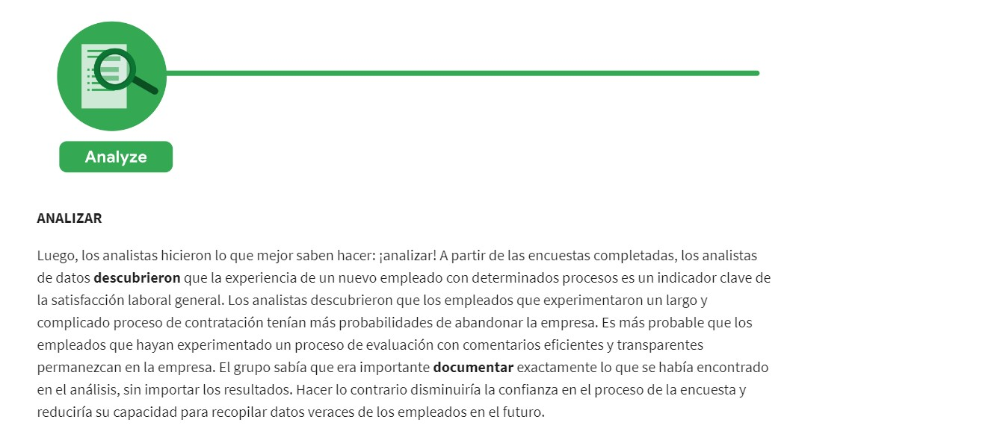

# Curso 1. Presentación del análisis computacional de datos

##### Analista de datos  
Alguien que colecciona, transforma y organiza datos con el fin de ayudar a tomar decisiones fundamentadas
##### Proceso para el análisis de datos  
- Preguntar  
- Preparar  
- Procesar  
- Analizar  
- Compartir
- Actuar  

##### Datos 
Recopilación de hechos o información  

### Transformación de datos en conocimiento  
Las empresas utilizan los datos para:  
- Mejorar procesos.  
- Identificar oportunidades y tendencias.    
- Lanzamientos nuevos.  
- Servicio a clientes.  
- Toma de decisiones bien pensadas.  

El análisis te ayuda a encontrar formas más fáciles de hacer las cosas, identificar patrones para ahorrar tiempo y descubrir nuevas perspectivas sorprendentes que pueden cambiar por completo la forma en que experimentas las cosas.  

La **ciencia de datos** abarca tres disciplinas:
- Machine Learning e IA: Automatización de muchas decisiones con incertidumbre.
- Estadistica: Toma de decisones importantes con incertidumbre.
- Análisis: Se desconocen las decisiones que se desean tomar antes de empezar.

### Análisis de personas  
Es la práctica de recopilar y analizar datos sobre las personas que conforman la fuerza laboral de una empresa con el fin de obtener información para mejorar su funcionamiento. Ser analista de personas implica utilizar el análisis de datos para obtener información sobre los empleados y cómo viven su vida laboral. El conocimiento se utiliza para definir y crear un lugar de trabajo más productivo y empoderador. Esto puede liberar el potencial de los empleados, motivar a las personas a rendir al máximo y garantizar una cultura empresarial justa e inclusiva.  

**Problematica:** Una organización estaba teniendo una alta tasa de rotación entre los nuevos empleados. Muchos empleados abandonaron la empresa antes del final de su primer año de trabajo. Los analistas utilizaron el proceso de análisis de datos para responder la siguiente pregunta: ¿cómo puede la organización mejorar la tasa de retención de los nuevos empleados?  

### Inteligencia de decisiones  
Es una combinación de la ciencia de datos aplicada y ciencias sociales y gerenciales.

