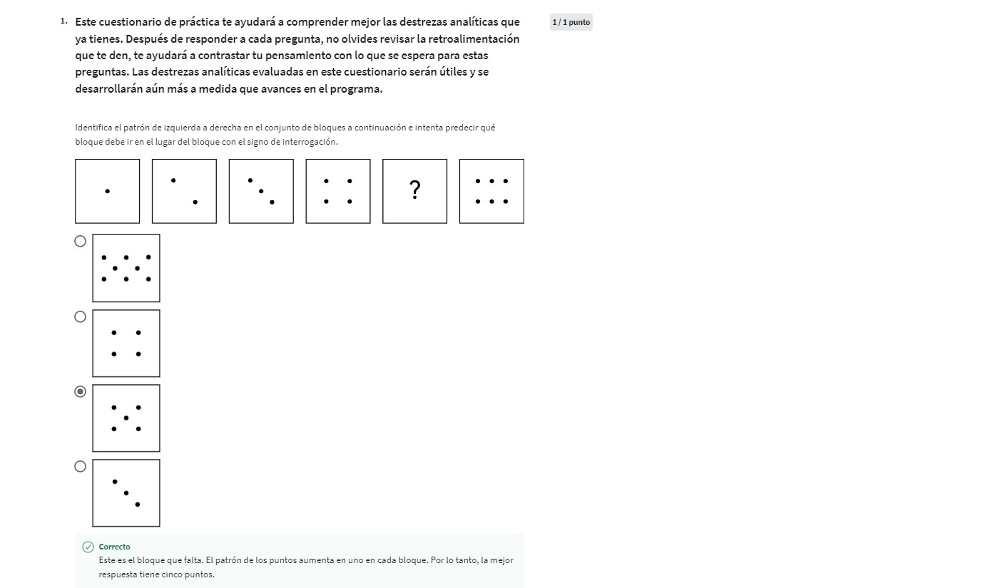
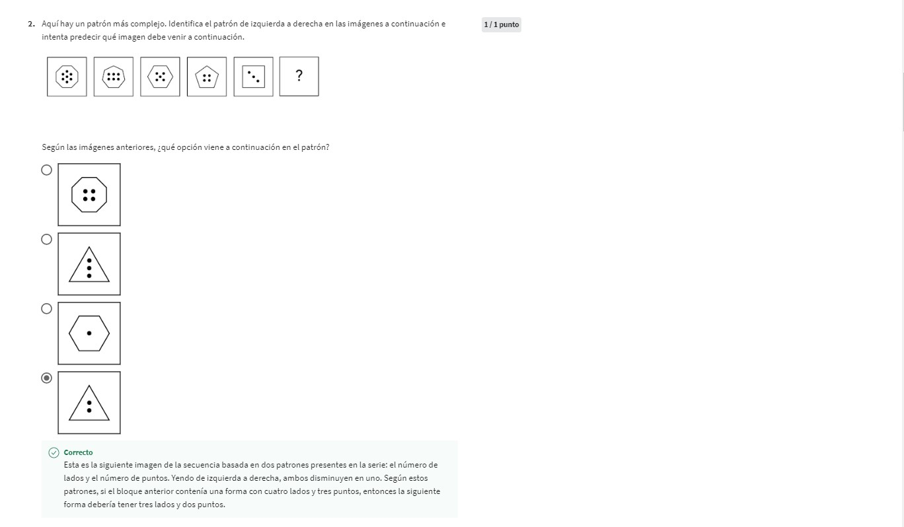
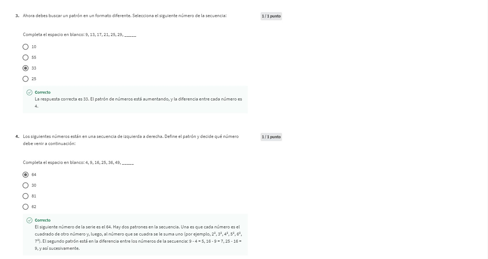
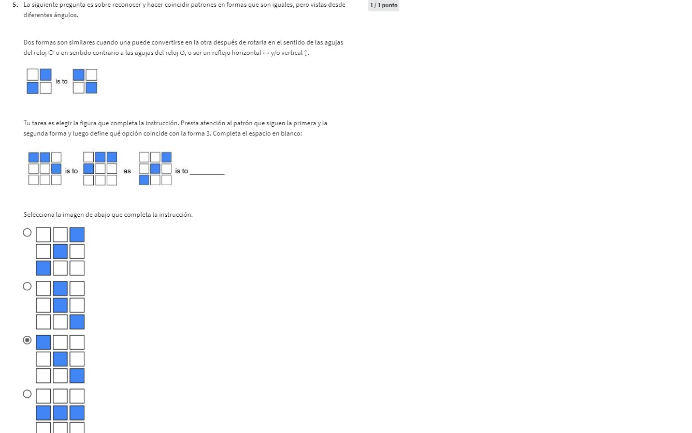
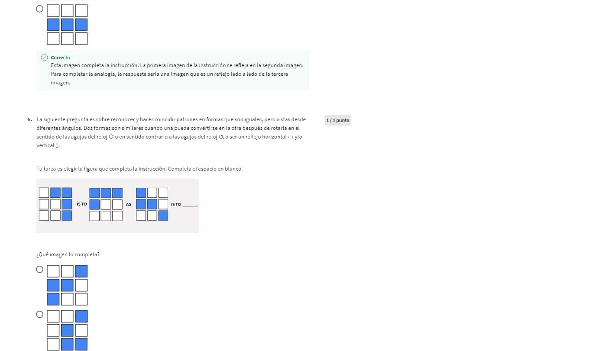
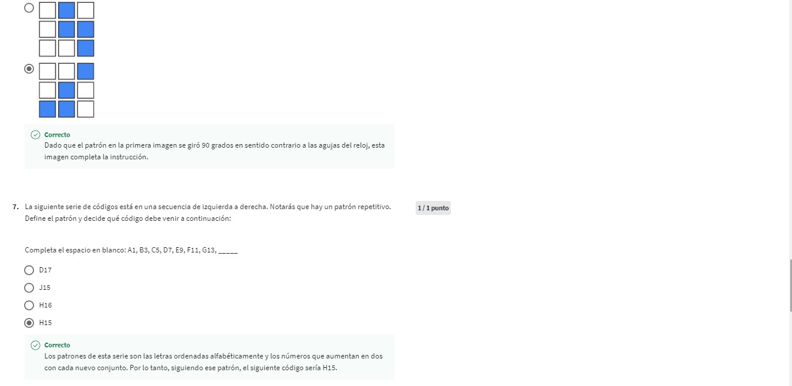
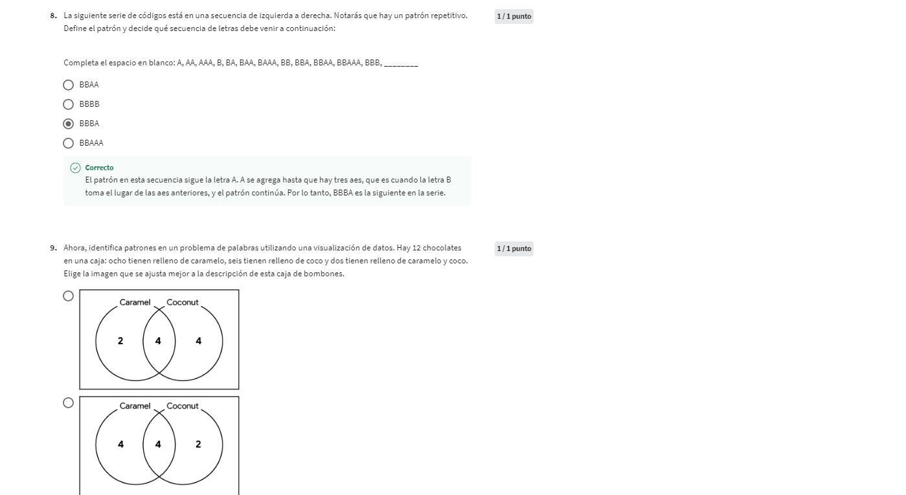
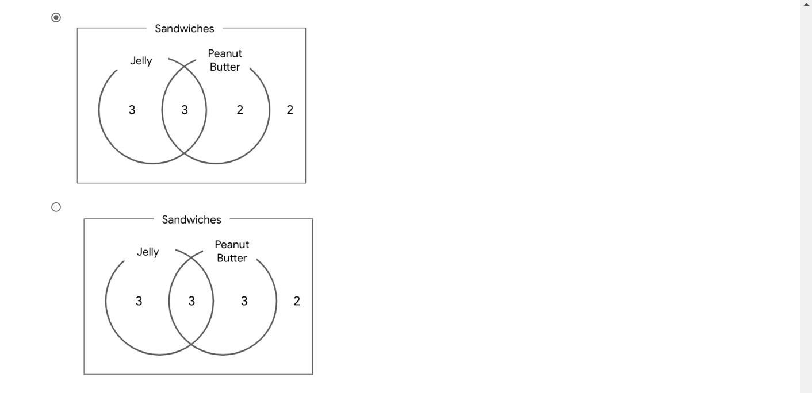

## 2. Descubrimiento de las destrezas relacionadas con los datos  
### *Aprovechar tus destrezas de analista de datos*  
#### Destrezas análiticas  
Son cualidades y características asociadas con la resolución de problemas usando hechos.  
Hay 5 destrezas análiticas que los analistas de datos poseen:  
1. **Curiosidad:** Se trata de querer aprender algo. Esto conduce al conocimiento.
2. **Comprensión del contexto:**  
    - **Contexto:** Es la condición en la que algo existe o sucede. Esto puede ser una estructura o un entorno.
3. **Mentalidad técnica:** Implica la capacidad de dividir las cosas en pasos o piezas más pequeñas, y trabajar con ellos de forma ordenada y lógica.
4. **Diseño de datos:** Es la forma de organizar la información. Como analista de datos, el diseño normalmente tiene que ver con una base de datos real.  
5. **Estrategia de datos:** Es la gestión de las personas, procesos y herramientas que se usan en el análisis de datos.  
Gestionas personas asegurandote que saben cómo utilizar los datos correctos para resolver el problema en el que estás trabajando. 
En cuanto a los procesos, se trata de asegurarte que el camino hacia la solución sea claro y accesible.  
Para las herramientas, te aseguras de que se utiliza la tecnología adecuada para el trabajo.  
#### Examen 1  

### *Pensar en el pensamiento analítico*  
#### Pensamiento analítico  
Consiste en identificar y definir un problema, y resolverlo mediante el uso de datos de manera organizada y paso a paso.  
**¿Cómo pensamos analiticamente?**
Para ello hay 5 aspectos básicos:  
1. **Visualización:** En el análisis (computacional) de datos, la visualización es la representación gráfica de la información. Algunos ejemplos son los gráficos, mapas u otros elementos de diseño. La visualización es importante porque los elementos visuales pueden ayudar a los analistas de datos a entender y explicar la información de manera más eficaz.
2. **Estrategia:** La elaboración de estrategias ayuda a los analistas de datos a ver lo que quieren conseguir con los datos y cómo pueden lograrlo. La estrategia
también ayuda a mejorar la calidad y utilidad de los datos que recopilamos. Mediante la elaboración de estrategias, sabemos que todos nuestros datos son valiosos y pueden ayudarnos a alcanzar nuestros objetivos. 
3. **Orientación hacia los problemas:** Los analistas de datos utilizan un enfoque orientado hacia los problemas para identificarlos, describirlos y resolverlos. Se trata de mantener el problema en mente a lo largo de todo el proyecto. Los analistas también realizan muchas preguntas, esto ayuda a mantener la comunicación y permite ahorrar tiempo mientras se busca una solución.
4. **Correlación:** Una correlación es como una relación. Se puede encontrar todo tipo de correlaciones en los datos. Una de ellas podría ser la relación entre la longitud del cabello y la cantidad de shampoo que se utiliza. *La correlación no equivale a la causalidad,* es decir que el hecho de que la tendencia de dos datos sea en la misma dirección, no necesariamente significa que estén relacionados.
5. **Pensamiento con perspectiva global y orientado hacia los detalles:** Significa ser capaz de ver el panorama general, así como los detalles, como un rompecabezas. Te ayuda a ampliar la visión, a ver las posibilidades y oportunidades. Esto condice a nuevas ideas o innovaciones interesantes.  
Por otra parte, el pensamiento orientado a los detalles consiste en averiguar todos los aspectos que te ayudarán a ejecutar un plan (las piezas del rompecabezas).
