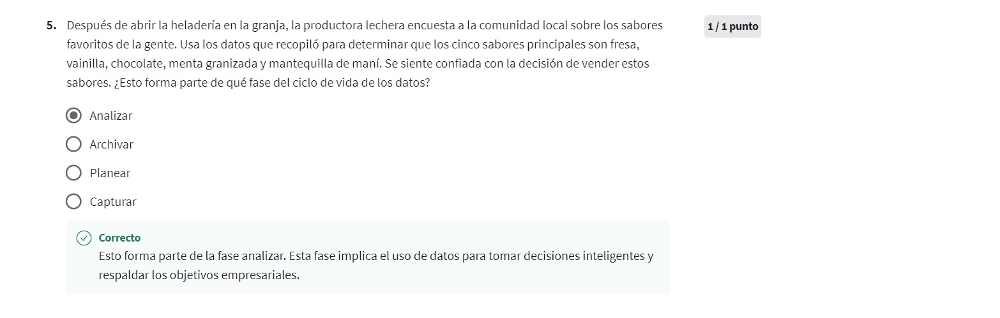

# El maravilloso mundo de los datos  
### Seguir el ciclo de vida de los datos  
Los analistas de datos dan vida a los datos con la herramienta de análisis correcta: hojas de cálculo, bases de datos, lenguajes de consulta y software de visualización.  
El ***ciclo de vida*** de los datos consiste en:
- **Planificar:** Durante la planificación, una empresa decide qué tipo de datos necesita, cómo se gestionarán a lo largo de su ciclo de vida, quién será responsable de ellos y cuáles son los resultados óptimos.
- **Capturar:** En esta fase, se recopilan datos de diversas fuentes y se incorporan en la organización. Debido a que se crean tabntos datos por día, los métodos de recopilación son infinitos. Un método común es obtener datos de recursos externos. Otra froma de obtener datos es a partir de documentos y archivos propios de una empresa, que, normalmente, se almacenan en una base de datos.
  - **Base de datos:** Conjunto de datos almacenados en un sistema informático.  
  Cuando se tiene una base de datos con información de clientes, debemos preocuparnos por garantizar la integridad, credibilidad y la privacidad de estos datos.
- **Gestionar:** Se trata de cómo cuidarlos, cómo y dónde se almacenan, qué herramientas se usan para protegerlos y mantenerlos seguros, y qué medidas se adoptan para asegurarse de que se conserven correctamente. Esta fase es muy importante para la limpieza de los datos.
- **Analizar:** Los datos se usan para resolver problemas, tomar decisiones importantes y respaldar los objetivos empresariales.
- **Archivar:** Significa almacenar datos en un lugar donde todavía están disponibles, pero es poco probable que se vuelvan a usar. Durante el análisis, los analistas manejan grandes cantidades de datos. Tien mucho más sentido archivarlos que mantenerlos a mano.
- **Destruir:** En caso de tener datos en discos duros, deberá utilizarse un software de destrucción de datos seguro. En caso de haber archivos impresos, se triturarán. Todos los respaldos también deben eliminarse.  

El ciclo de vida de los datos proporciona un framework génerico o común sobre cómo se gestionan los datos. Algunas visiones de cómo el gobierno y las instituciones educativas y financieras pueden ver los ciclos de vida de los datos de una manera un poco diferente se muestran a continuación.  
#### Servicio de pesca y vida silvestres de EE.UU.
El servicio de pesca y vida silvestre de los Estados Unidos utiliza el siguiente ciclo de vida de los datos:  
- Planificar
- Adquirir
- Mantener
- Accede
- Evaluar
- Archivar  
[U.S. Fish & Wildlife Service](https://www.fws.gov/data/life-cycle)
#### Servicio Geológico de los Estados Unidos (USGS)  
Ek USGS utiliza elsiguiente ciclo de vida de los datos:  
- Planificar
- Adquirir
- Procesar
- Analizar
- Preservar
- Publicar/Compartir
También realiza varias actividades transversales o generales durante cada etapa de su ciclo de vida:  
- Describir (metadaos y documentación)  
- Gestionar la calidad  
- Realizar copias de seguridad y asegurar   
[USGS](https://www.usgs.gov/data-management/data-lifecycle) 
#### Instituciones financieras  
Las instituciones financieras pueden adoptar un enfoque ligeramente diferente del ciclo de vida de los datos, tal como se describe en *The Data Life Cycle (El ciclo de vida de los datos)*, un artículo publicado en la revista Strategic Finance:
- Capturar
- Calificar
- Transformar
- Utilizar
- Informar
- Archivar
- Depurar  
[The data life cycle](https://sfmagazine.com/post-entry/july-2018-the-data-life-cycle/) 
#### Escuela de Negocios de Harvard (HBS)  
Un ciclo de vida final de datos informados en una investigación realizada por la Universidad de Harvard consta de ocho etapas:  
- Generación
- Recolección
- Procesamiento
- Almacenamiento
- Gestión
- Análisis
- Visualización
- Interpretación  
[Steps in the data life cycle](https://online.hbs.edu/blog/post/data-life-cycle)    

**Caso de estudio**

  
#### Examen 1  

### Esbozar el proceso de análisis de datos  
El análisis de los datos no es un ciclo de vida. Es el proceso de analizar los datos.  
**Preguntar:** En esta fase se hacen dos cosas. Se deine el problema que se pretende resolver y se asegura de que se entiende plenamente las expectativas de los interesados. 
Una parte importante de preguntar es entender las expectativas de los interesados. Es necesario definir, quienes son los interesados. Puede haber muchos interesados. Sin embargo, lo que todos tienen en común es que ayudan a tomar decisiones, infuyen en las acciones y estrategias, y tienen objetivos específicos por cumplir.  
Comunicarse con los interesados es clave para mantener el nivel de compromiso y la concentración en todo momento durante el proyecto.  

**Stakeholders:** Son personas que han dedicado tiempo y recursos a un proyecto, y están interesadas en el resultado.
Definir un problema significa que observas el estado actual e identificas cómo difiere del estado ideal.  
**Preparación del proceso de análisis de datos:** En este punto, los analistas de datos recopilan y almacenan datos que usarán para el próximo proceso de análisis. Cualquier decisión que se tome a partir del análisis siempre debe basarse en hechos y ser justa e imparcial.  
**Proceso:** En este, los analistas de datos ecuentran y eliminan cualquier error e inexactitud que pueda interferir con los resultados. Esto suele implicar la limpieza de los datos, su conversión a un formato más útil, combinar dos o más conjuntos de datos para lograr que la información sea más completa y eliminar los valores atípicos, que son puntos de datos que podrían sesgar la información.  
**Preparación:** En esta fase, el propósito es que los detalles sean correctos. Así que también se corrigen errores tipográficos, incoherencias o datos inexactos o faltantes.  
**Analizar:** Analizar los datos recopilados, implica el uso de herramientas para transformar y organizar esta información a fin de poder extraer conclusiones útiles, hacer predicciones e impulsar una toma de decisiones fundamentada.  
**Compartir:** La visualización es importante para conseguir que otras personas comprendan qué dicen los datos.  
**Actuar:** Es el momento en que la empresa toma toda la información que el analista de datos, ha proporcionado y la pone a trabajar para resolver el problema inicial del negocio y actuar.  
