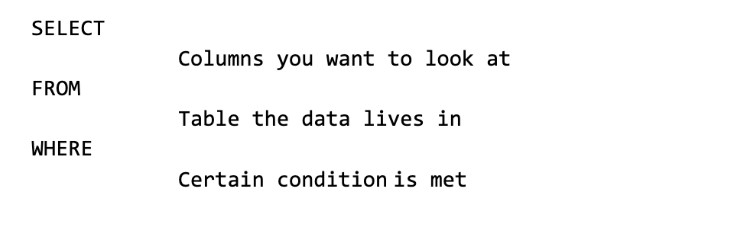
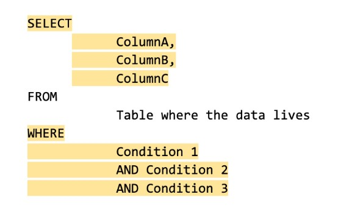
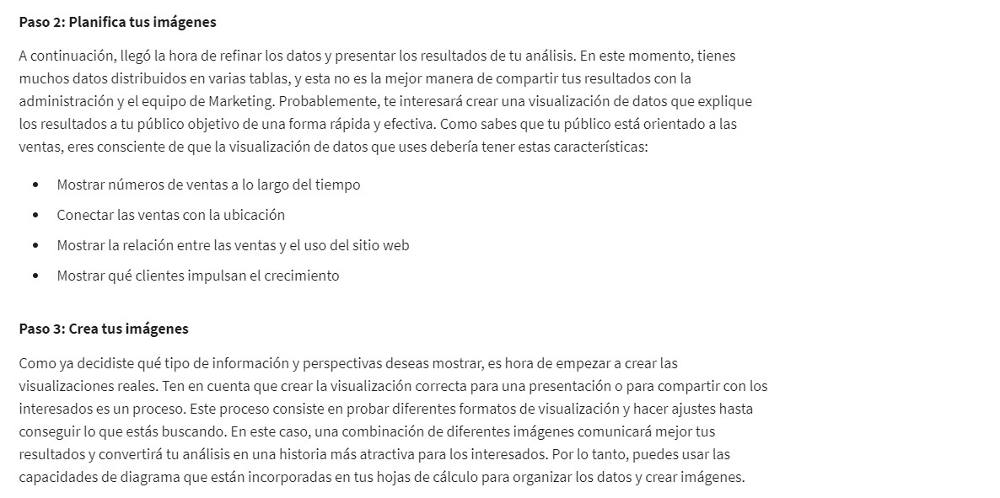
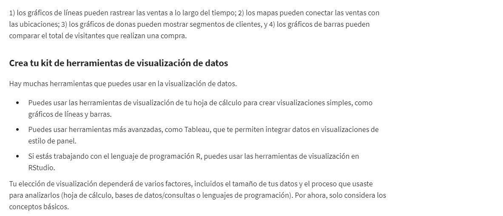

# Los pormenores de la herramientas de datos centrales  
### Dominio de los conceptos básicos de la hoja de cálculo  
**Columnas:** Se encuentran verticalmente y organizadas por letras.  
**Filas:** Se encuentran horizontalmente y ordenadas por números. También se llama observación.  
**Celda:** Combinación de fila y columna.  
**Atributo:** Es una característica o cualidad de los datos que se utilizan para etiquetar la columna de una tabla. También suelen llamarse nombres de columna, etiquetas de columna, encabezados o fila de encabezado.  
**Observación:** Incluye todos los atributos de algo contenido en una fila de una tabla de datos.    
**Fórmula:** Conjunto de instrucciones que realiza una acción específica utilizando los datos de una hoja de cálculo. Utiliza referencias de celdas para los valores que está calculando.  
#### Links para aprendizaje de hojas de cálculo
[googlesheets](https://support.google.com/a/users/answer/9282959?visit_id=637361702049227170-1815413770&rd=1)  
[gs](https://support.google.com/a/users/answer/9300022)  
[excel](https://support.microsoft.com/en-us/office/excel-video-training-9bc05390-e94c-46af-a5b3-d7c22f6990bb)  
#### Examen 1 

  
### Lenguaje de consulta estructurado (SQL)  
Puede ser utilizado para almacenar, organizar y analizar los datos, entre otras cosas. Las consultas son universales.  
Bases que utilizan SQL: Oracle, PostgreSQL, Microsoft SQL Server, etc.  
**Consulta (query):** es una solicitud de datos o información proveniente de una base de datos.
-----------------------------------------------------------------------------------------------------------------------------  
Las computadoras usan diferentes idiomas para comunicarse entre sí, al igual que los seres humanos. El lenguaje de consulta estructurado (SQL, que se pronuncia “ese-cu-ele”) permite a los analistas de datos hablar con sus bases de datos. SQL es una de las herramientas de análisis de datos más útiles, especialmente cuando se trabaja con grandes conjuntos de datos en tablas. Puede ayudarte a investigar grandes bases de datos y rastrear texto (conocido como cadenas) y números, y filtrar el tipo exacto de datos que necesitas, mucho más rápido que una hoja de cálculo.  

Si es la primera vez que usas SQL, esta lectura te ayudará a adquirir los conceptos básicos para que veas lo útil que es SQL y, en particular, las consultas. Empezarás a escribir consultas SQL en muy poco tiempo.  
**¿Qué es una consulta?**
Una consulta es una solicitud de datos o información que proviene de una base de datos. Cuando consultas bases de datos, usas SQL para comunicar tu pregunta o solicitud. Puedes intercambiar información con la base de datos siempre y cuando dominen el mismo idioma.  
Cada lenguaje de programación, incluido SQL, sigue un conjunto de pautas único que se conoce como sintaxis. La sintaxis es la estructura predeterminada de un lenguaje, que incluye todas las palabras, los símbolos y la puntuación requeridos, así como su correcta colocación. Cuando escribes tus criterios de búsqueda con la sintaxis correcta, la consulta empieza a trabajar en extraer los datos que solicitaste de la base de datos de destino.  
La sintaxis de cada consulta SQL es la misma:  
- Usa SELECT para elegir las columnas que deseas devolver.  
- Usa FROM para elegir las tablas donde se encuentran las columnas que deseas.  
- Usa WHERE para filtrar determinada información.  
Una consulta SQL es como rellenar una plantilla. Descubrirás que, si escribes una consulta SQL desde cero, es mucho mejor iniciar una consulta escribiendo las palabras clave SELECT, FROM y WHERE en el siguiente formato: 

A continuación, escribe el nombre de la tabla después del FROM, las columnas de la tabla que deseas después de SELECT y, por último, las condiciones que quieres agregar a tu consulta después del WHERE. Asegúrate de agregar un nuevo renglón y sangría cuando las agregues, como se muestra a continuación:  

Seguir este método facilita el proceso de escribir consultas SQL. También puede ayudarte a cometer menos errores de sintaxis.  
**Ejemplo de una consulta**  
Así es como aparecería una simple consulta en BigQuery, un almacén de datos de Google Cloud Platform.  
La consulta anterior usa tres comandos para localizar clientes que se llaman Tony:  
1. ELEGIR (SELECT) la columna denominada nombre (first_name)  
2. DESDE (FROM) una tabla denominada nombre_del_cliente (customer_data) (en un conjunto de datos denominado nombre_del_cliente [customer_data]) (el nombre del conjunto de datos siempre va seguido de un punto y, a continuación, del nombre de la tabla).  
3. Pero solo se devuelven los datos DONDE (WHERE) el primer_nombre (first_name) es Tony  
Los resultados de la consulta pueden ser similares a los siguientes:  

En conclusión, esta consulta tenía la sintaxis correcta, pero no fue muy útil después de la devolución de los datos.  
**Varias columnas en una consulta**  
En la vida real, tendrás que trabajar con más datos, además de los clientes llamados Tony. El mismo comando SELECT elige varias columnas que se pueden sangrar y agrupar.  
Si solicitas varios campos de datos de una tabla, debes incluir estas columnas en el comando SELECT. Cada columna está separada por una coma, como se muestra a continuación:  

Este es un ejemplo de cómo aparecería en BigQuery:  

La consulta anterior usa tres comandos para localizar clientes que se llaman Tony:  
1. ELEGIR (SELECT) las columnas denominadas id_del_cliente (customer_id), nombre (first_name) y apellido (last_name)
2. DESDE (FROM) una tabla denominada nombre_del_cliente (customer_data) (en un conjunto de datos denominado nombre_del_cliente [customer_data]) (el nombre del conjunto de datos siempre va seguido de un punto y, a continuación, del nombre de la tabla)3. Pero solo se devuelven los datos DONDE (WHERE) el nombre (first_name) es Tony”  
3. Pero solo se devuelven los datos DONDE (WHERE) el nombre (first_name) es Tony  
La única diferencia entre esta consulta y la anterior es que se eligen más columnas de datos. La consulta anterior eligió solamente el nombre (first_name), mientras que esta consulta elige el ID_del_cliente (customer_id) y el apellido (last_name), además del nombre (first_name). En general, para usar los recursos de manera más eficiente, debes elegir solo las columnas que necesitas. Por ejemplo, tiene sentido que elijas más columnas si vas a usar los campos adicionales en tu cláusula WHERE. Si tienes varias condiciones en tu cláusula WHERE, pueden escribirse de la siguiente manera:  

Ten en cuenta que, a diferencia del comando SELECT, que usa una coma para separar campos/variables/parámetros, el comando WHERE usa la instrucción AND para conectar condiciones. Cuando te conviertas en un escritor de consultas más experimentado, usarás otros conectores u operadores, como OR y NOT.  
Este es un ejemplo de BigQuery con varios campos usados en una cláusula WHERE:  

La consulta anterior usa tres comandos para localizar clientes con un ID de cliente válido (mayor que 0) cuyo nombre es Tony, y su apellido es Magnolia.  
1. ELEGIR (SELECT) las columnas denominadas id_del_cliente (customer_id), nombre (first_name) y apellido (last_name)  
2. DESDE (FROM) una tabla denominada nombre_del_cliente (customer_data) (en un conjunto de datos denominado nombre_del_cliente [customer_data]) (el nombre del conjunto de datos siempre va seguido de un punto y, a continuación, del nombre de la tabla).  
3. Pero solo devuelve los datos DONDE (WHERE) el ID_del_cliente (customer_id) es mayor que 0, el nombre (first_name) es Tony y el apellido (last_name) es Magnolia.  
Ten en cuenta que una de las condiciones es una condición lógica que comprueba si el ID_del_cliente (customer_id) es mayor que cero.  
Si un cliente se llama Tony Magnolia, los resultados de la consulta podrían ser:  

Si hay más de un cliente con el mismo nombre, los resultados de la consulta podrían ser:  
  
### Las posibilidades de SQL son infinitas  
Has aprendido que una consulta SQL usa SELECT, FROM y WHERE para especificar los datos que se devolverán desde la consulta. Esta lectura proporciona información más detallada sobre cómo estructurar las consultas, usar condiciones WHERE, elegir todas las columnas en una tabla, agregar comentarios y usar alias. Esta información hace que sea más fácil para ti entender (y escribir) consultas para poner SQL en práctica. En la última sección de esta lectura, se proporciona un ejemplo de lo que haría un analista de datos a fin de extraer los datos de los empleados para un proyecto.  
**Uso de mayúsculas, sangría y punto y coma**  
Puedes escribir tus consultas SQL solo en minúsculas, y no tienes que preocuparte por los espacios adicionales entre palabras. Sin embargo, el uso de mayúsculas y sangría puede ayudarte a leer la información más fácilmente. Mantén tus consultadas ordenadas. Serán más fáciles de revisar o solucionar si necesitas comprobarlas más adelante.  
  
Ten cuenta que la instrucción SQL que se muestra arriba tiene un punto y coma al final. El punto y coma es un terminador de instrucción que forma parte de la norma SQL-92 del Instituto Nacional Estadounidense de Estándares (ANSI), la cual es una sintaxis común recomendada para su adopción por todas las bases de datos SQL. Sin embargo, no todas las bases de datos SQL han adoptado o cumplido con el uso del punto y coma, por lo que es posible que te encuentres con algunas instrucciones SQL que no terminan con un punto y coma. Si una instrucción funciona sin punto y coma, es correcta.  
**Condiciones WHERE**  
En la consulta que se mostró anteriormente, la cláusula SELECT identifica la columna de la cual deseas extraer datos por nombre, field1, y la cláusula FROM identifica la tabla donde se encuentra la columna por nombre, table. Por último, la cláusula WHERE restringe la consulta para que la base de datos devuelva solo los datos con una coincidencia de valor exacta, o los datos que coincidan con una determinada condición que deseas satisfacer.  
Por ejemplo, si estás buscando a un cliente específico con el apellido Chavez, la cláusula WHERE sería:   
WHERE field1 = 'Chavez'  
Sin embargo, si estás buscando a todos los clientes que tienen un apellido que empieza con las letras “Ch”, la cláusula WHERE sería:  
WHERE field1 LIKE 'Ch%'  
En conclusión, la cláusula LIKE es muy poderosa porque te permite decirle a la base de datos que busque un patrón determinado. El signo de porcentaje (%) se usa como comodín para que coincida con uno o más caracteres. En el ejemplo anterior, se devolverían tanto Chávez como Chen. Ten en cuenta que en algunas bases de datos se usa un asterisco (*) como comodín en lugar de un signo de porcentaje (%).  
**ELEGIR (SELECT) todas las columnas**  
¿Puedes usar SELECT * ?  
En el ejemplo, si reemplazaras SELECT field1 por SELECT * , elegirías todas las columnas de la tabla en lugar de la columna field1 sola. Desde el punto de vista de la sintaxis, es una instrucción SQL correcta, pero debes usar el asterisco (*) con moderación y precaución. Según cuántas columnas tenga una tabla, es posible que elijas una enorme cantidad de datos. Si eliges demasiados datos, es posible que la consulta se ejecute muy lentamente.  
**Comentarios**  
Algunas tablas no están diseñadas con convenciones de nomenclatura suficientemente descriptivas. En el ejemplo, field1 era la columna del apellido de un cliente; pero no podrías saberlo por el nombre. Un nombre más adecuado podría haber sido algo como last_name. En estos casos, puedes agregar comentarios junto a tu SQL para ayudarte a recordar qué representa el nombre. Los comentarios son textos colocados entre ciertos caracteres, /* y */, o después de dos guiones (--), como se muestra a continuación.  
  
Los comentarios también se pueden agregar dentro o fuera de una instrucción. Puedes usar esta flexibilidad para proporcionar una descripción general de lo que harás, notas paso a paso sobre cómo lo lograrás y por qué estableces diferentes parámetros o condiciones.  
  
Mientras más cómodo te sientas con SQL, más fácil te resultará leer y comprender las consultas de un vistazo. Aun así, nunca está de más que tengas comentarios en una consulta para recordar lo que estás tratando de hacer. Esto también facilita que otros usuarios entiendan tu consulta si la compartes con ellos. A medida que tus consultas se vuelvan más complejas, esta práctica te ahorrará mucho tiempo y energía para comprender las consultas complejas que escribiste hace meses o años.  
**Ejemplo de una consulta con comentarios**  
Este es un ejemplo de cómo se pueden escribir los comentarios en BigQuery:  
  
En el ejemplo anterior, se agregó un comentario antes de la instrucción SQL para explicar qué hace la consulta. Además, se agregó un comentario junto a cada uno de los nombres de columna para describir la columna y su uso. Generalmente, se admiten dos guiones (--). Por lo tanto, se recomienda usarlos de manera coherente. Puedes usar # en lugar de -- en la consulta anterior, pero # no se reconoce en todas las versiones de SQL; por ejemplo, MySQL no reconoce #.  También puedes colocar comentarios entre /* y */ si la base de datos que estás usando lo permite.  
A medida que perfecciones tus capacidades desde un punto de vista profesional, según la base de datos SQL que uses, podrás elegir los símbolos de delimitación de comentarios adecuados que prefieras y continuar su uso para mantener un estilo coherente. A medida que tus consultas se vuelvan más complejas, esta práctica te ahorrará mucho tiempo y energía para comprender las consultas complejas que escribiste, probablemente, hace varios meses o años.  
**Alias**  
Para simplificarte la tarea, puedes asignar un nuevo nombre o alias a los nombres de columna o tabla para que sea más fácil trabajar con ellos (y evitar la necesidad de agregar comentarios). Esto se hace con una cláusula SQL AS. En el siguiente ejemplo, se asigna el alias last_name a field1 y el alias customers a table.Estos alias son válidos solo para la duración de la consulta. Un alias no cambia el nombre real de una columna o tabla de la base de datos.  
**Ejemplo de una consulta con alias**  
 
#### Links para aprendizaje 
[SQL](https://www.w3schools.com/sql/default.asp)  
[SQL Cheet Sheet](https://towardsdatascience.com/sql-cheat-sheet-776f8e3189fa) 
#### Examen 2

  

  
  

#### Visualización de datos  
Representación gráfica de la información.  
  
  
  
  
  
  
  
  
#### Links para aprendizaje  
**Tableau**  
[Video instructivo](https://public.tableau.com/app/resources/learn)  
[Visualización del día](https://public.tableau.com/app/discover/viz-of-the-day)  
[Búsqueda de planetas habitables](https://public.tableau.com/app/profile/kimly.scott/viz/Arewealone/AreWeAlone)  
[Quién habla en peliculas populares](https://public.tableau.com/app/profile/bo.mccready8742/viz/WordDataWorking/WhoIsTalking)  
**RStudio**  
[Hojas de referencia](https://www.rstudio.com/resources/cheatsheets/)  
