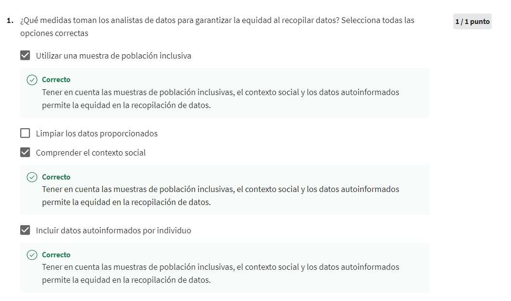

# Posibilidades profesionales  

Las habilidades de un analista de datos pueden ser aplicadas en industrias como:  
- Tecnología.  
- Marketing.  
- Finanzas.  
- Atención médica.    
- Muchas más.   

Se usan todo tipo de datos para determinar la confiabilidad y precisión de un sitio web para asegurarnos de obtener los datos más útiles.  
Las pequeñas empresas pueden utilizar el análisis de datos para comprender mejor los hábitos de compra de sus clientes, crear mensajes más efectivos en las redes sociales, o en el caso de un zoológico y acuario de una ciudad, predecir la cantidad de visitantes diarios en función de los datos del clima local.  
**Issue:** Es un asunto o tema para investigar.  
**Pregunta:** Esta diseñada para descubrir información.  
**Problema:** Es un obstáculo o complicación que es necesario resolver.  
**Tarea empresarial:** Es la pregunta o problema que el análisis de datos responde para las empresas.  
**Toma de decisiones basada en datos:** Es cuando los hechos que se han descubierto a través del análisis de datos se utilizan para guiar la estrategia empresarial.  
**Equidad:** Significa asegurarse de que tu análisis no instroduzca ni refuerce sesgos. Los analistas deben crear sistemas equitativos e inclusivos para todos.  
A veces las decisiones basadas en datos pueden ser verdaderas e inequitativas.  
#### Estudios de caso para análisis

#### Examen 1

  

### Factores a explorar para el trabajo
- La industria.  
- Las herramientas.  
- La ubicación.  
- Los viajes.  
- La cultura.  

#### Examen final  
  
  
  
  
  
  
  
  
  

